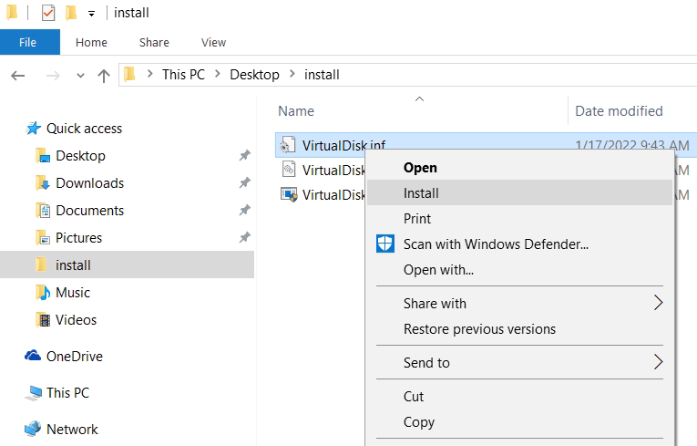
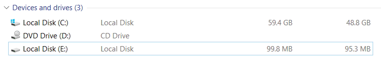

# How to develop a Virtual Disk Driver for Windows

- [How to develop a Virtual Disk Driver for Windows](#how-to-develop-a-virtual-disk-driver-for-windows)
  - [Introduction](#introduction)
    - [What is a driver?](#what-is-a-driver)
    - [What is a device?](#what-is-a-device)
    - [What is a virtual disk?](#what-is-a-virtual-disk)
    - [What is WDF?](#what-is-wdf)
    - [C++ in drivers](#c-in-drivers)
  - [Prerequisites](#prerequisites)
  - [Developing](#developing)
    - [Driver](#driver)
      - [Pch](#pch)
      - [Main](#main)
      - [Driver class](#driver-class)
      - [Device class](#device-class)
        - [Create](#create)
        - [Init](#init)
        - [IOCTLs](#ioctls)
        - [Read/write](#readwrite)
      - [Property keys](#property-keys)
      - [NewImpl](#newimpl)
    - [Control utility](#control-utility)
  - [Running](#running)
  - [Final notes](#final-notes)
  - [References](#references)

## Introduction

In this article we'll create a driver for a virtual disk device and a control utility to manage it.


The target operating system is Windows 10. The goal is to demonstrate the following topics:

* how to write a driver?
* using C++ in drivers
* using WDF
* handling IOCTLs
* understanding of device stacks
* using Software Device API

### What is a driver?
A driver is a software component that works tightly with an OS. With the help of drivers an OS exposes functionality of various hardware to user applications. Some drivers have no actual hardware: they emulate it or alter behavior of other drivers.

### What is a device?
Hardware components are called devices (for example CD-ROM or USB flash drive). Drivers create software objects that represent those hardware components and they are also called devices. So a device can be referred to software as well as to hardware.

### What is a virtual disk?
A disk device provides storage for data. Usually it isn't used directly but by the means of a file system. Thus we can work with files and directories and see disk devices as drive letters: C:, D:, E: and so on. Why is our device virtual? Because it has no real hardware to store data. Instead it stores data in an ordinary file:


Virtual disk drivers are used to mount CD/DVD images (ISO), virtual machine disk images (VHD/VHDX, VMDK, VDI) or to provide an encrypted storage for sensitive data.

### What is WDF?
WDF is a Windows Driver Framework (formerly called Foundation) developed by Microsoft. It greatly simplifies driver development. For example it reduces a dummy plug-n-play driver from 3000 to 300 lines of code. So we highly recommend using WDF instead of low-level WDM.

WDF consists of 2 parts:

* KMDF (Kernel-Mode Driver Framework)
* UMDF (User-Mode Driver Framework)

For our driver we'll use KMDF and thus it will run in kernel mode.

### C++ in drivers
Some time ago Windows drivers were written only on C. But nowadays C++ gets into this domain as a more advanced and less error-prone language. Our driver will be written on C++ however only a very basic functionality of the language will be used. So the code will be understandable to the people who don't know C++ but know C.

## Prerequisites
Things you need to have before we begin:

* Windows 10
* Visual Studio 2019
* WDK 10
* basic C/C++ knowledge
* virtual machine (Hyper-V, VmWare, VirtualBox, QEMU, ...)

Always use a virtual machine to run the driver you develop! That way you can protect your machine from driver failures.

## Developing

It's very recommended to setup kernel-mode debugging. You can refer to the official documentation about that: [Getting Started with Windows Debugging](https://docs.microsoft.com/en-us/windows-hardware/drivers/debugger/getting-started-with-windows-debugging).

### Driver
A driver project has its own template in Visual Studio. So we will use it. A typical driver project has a bunch of C/CPP and H files with code, RC file for resources and INF file for installation instructions.


Now let's go through our virtual disk driver code and say a couple of words about each part of it.

#### Pch
This is a precompiled header. It contains includes of system headers and reduces build times as it is compiled only once (and not for each CPP file).

#### Main
`Main.cpp` contains a driver entry point: the very first driver function that will be called by the Windows kernel. What it does is delegates all the work to our `Driver` class. Note that `DriverEntry` is marked as an `EXTERN_C` function:

```cpp
EXTERN_C NTSTATUS DriverEntry(_In_ PDRIVER_OBJECT driverObject, _In_ PUNICODE_STRING registryPath)
{
    return Driver::create(driverObject, registryPath);
}
```

#### Driver class
`Driver` is a simple class that has only 2 methods:

* `Driver::create` - Initializes a driver object by calling a corresponding WDF function and registers `Driver::onDeviceAdd` callback.
* `Driver::onDeviceAdd` - A callback that is called for each device object that matches our driver; there we are creating an instance of our `Device` class.

```cpp
NTSTATUS Driver::create(PDRIVER_OBJECT driverObject, PUNICODE_STRING registryPath)
{
    WDF_DRIVER_CONFIG config;
    WDF_DRIVER_CONFIG_INIT(&config, onDeviceAdd);

    return WdfDriverCreate(driverObject, registryPath, WDF_NO_OBJECT_ATTRIBUTES, &config, WDF_NO_HANDLE);
}

NTSTATUS Driver::onDeviceAdd(WDFDRIVER, PWDFDEVICE_INIT deviceInit)
{
    return Device::create(deviceInit);
}
```

#### Device class
This is where all the work is done.

Device objects in Windows are layered and form stacks. From below our device object is attached to the so-called physical device object. In our case it belongs to the SoftwareDevice driver and its role is just to report a hardware id to the system so our driver will be matched to that hardware id, loaded and our `Driver::onDeviceAdd` will be called. From above our device is attached (mounted) to the volume device object that belongs to the file system driver. Also note that it forms another device stack. The volume device object is seen by applications as a drive letter.

In reality there are also filter device objects in both storage and filesystem stacks. They add additional functionality like providing disk snapshots for backup or checking files for viruses.


##### Create
`Device::create` method sets device name, security and type. After that it calls `WdfDeviceCreate` to create a device object and allocate a memory for the instance of our `Device` class. Also it registers `Device::onCleanup` handler that will cleanup resources by calling the class destructor.

When the instance of our `Device` class is created we call `Device::init` to continue initialization:

```cpp
//
// Create device
//

WDF_OBJECT_ATTRIBUTES deviceAttributes;
WDF_OBJECT_ATTRIBUTES_INIT_CONTEXT_TYPE(&deviceAttributes, Device);
deviceAttributes.EvtCleanupCallback = onCleanup;

WDFDEVICE wdfDevice;
status = WdfDeviceCreate(&deviceInit, &deviceAttributes, &wdfDevice);
if (!NT_SUCCESS(status))
{
    return status;
}

//
// Initialize device
//

auto self = new(getDevice(wdfDevice)) Device();

status = self->init(wdfDevice);
if (!NT_SUCCESS(status))
{
    return status;
}
```

##### Init
`Device::init` reads the device property key where we store a path to the file we're going to use as a virtual disk. Then it opens the file, gets its size, creates a device interface with the system predefined type `GUID_DEVINTERFACE_VOLUME` and creates 2 queues for processing requests: the default queue and the file queue (we'll get back to them later).

##### IOCTLs
IOCTLs are used to report meta-information about our device (disk size, writability, geometry and etc):

```cpp
void Device::onIoDeviceControl(WDFQUEUE queue, WDFREQUEST request, size_t outputBufferLength, size_t, ULONG ioControlCode)
{
    NTSTATUS status = STATUS_SUCCESS;
    ULONG_PTR bytesWritten = 0;
    auto self = getDevice(queue);

    //
    // Handle required control codes
    //

    switch (ioControlCode)
    {
    case IOCTL_STORAGE_GET_DEVICE_NUMBER:
    {
        STORAGE_DEVICE_NUMBER* info;
        status = WdfRequestRetrieveOutputBuffer(request, sizeof(*info), reinterpret_cast<void**>(&info), nullptr);
        if (!NT_SUCCESS(status))
        {
            break;
        }

        info->DeviceType = FILE_DEVICE_DISK;
        info->DeviceNumber = MAXULONG;
        info->PartitionNumber = MAXULONG;

        bytesWritten = sizeof(*info);
        break;
    }
    ...
```

The list of implemented IOCTL codes:

* IOCTL_STORAGE_GET_DEVICE_NUMBER
* IOCTL_STORAGE_GET_HOTPLUG_INFO
* IOCTL_DISK_GET_LENGTH_INFO
* IOCTL_DISK_GET_MEDIA_TYPES
* IOCTL_DISK_GET_DRIVE_GEOMETRY
* IOCTL_DISK_IS_WRITABLE
* IOCTL_MOUNTDEV_QUERY_DEVICE_NAME
* IOCTL_MOUNTDEV_QUERY_UNIQUE_ID

The system uses more IOCTLs but they are not required for the basic functionality. Because not all IOCTLS are implemented, advanced disk features (like those can be found in the Disk Management snap-in) will not work.

##### Read/write
Device read/write handlers get buffer, length and offset and perform read/write with those parameters from the disk image file:

```cpp
void Device::onIoRead(WDFQUEUE queue, WDFREQUEST request, size_t length)
{
    //
    // Get buffer and parameters
    //

    PVOID outputBuffer;
    NTSTATUS status = WdfRequestRetrieveOutputBuffer(request, 0, &outputBuffer, nullptr);
    if (!NT_SUCCESS(status))
    {
        WdfRequestCompleteWithInformation(request, status, 0);
        return;
    }

    WDF_REQUEST_PARAMETERS requestParams;
    WDF_REQUEST_PARAMETERS_INIT(&requestParams);
    WdfRequestGetParameters(request, &requestParams);

    //
    // Read from file
    //

    IO_STATUS_BLOCK iosb{};
    status = ZwReadFile(getDevice(queue)->m_fileHandle,
        nullptr,
        nullptr,
        nullptr,
        &iosb,
        outputBuffer,
        static_cast<ULONG>(length),
        reinterpret_cast<PLARGE_INTEGER>(&requestParams.Parameters.Read.DeviceOffset),
        nullptr);
    WdfRequestCompleteWithInformation(request, status, iosb.Information);
}
```

But there is a catch: file operations in the Windows kernel need APC (asynchronous procedure call) to be enabled for the thread. But for the thread where our read/write handler is invoked APC is disabled. So we need another thread to process them.

We will use the following trick. Our driver has 2 request queues: the default queue and the file queue. The default queue processes all requests. If a request is a read/write operation it forwards the request to the file queue. The default queue can process requests at any IRQL. The file queue supports only PASSIVE_LEVEL IRQL. We will raise IRQL to DISPATCH_LEVEL before forwarding the read/write request thus WDF couldn't process the request in the current thread and will use a worker thread.


This is how the forward function looks:

```cpp
void Device::onIoReadWriteForward(WDFQUEUE queue, WDFREQUEST request, size_t)
{
    //
    // Forward read/write requests to the file i/o queue. To force processing in another thread raise IRQL.
    //

    KIRQL oldIrql;
    KeRaiseIrql(DISPATCH_LEVEL, &oldIrql);
    WdfRequestForwardToIoQueue(request, getDevice(queue)->m_fileQueue);
    KeLowerIrql(oldIrql);
}
```

#### Property keys
We need somehow to pass a disk file image path to the driver for device initialization. Device properties are a convenient mechanism for that. `PropertyKeys.h` contains a definition of our device property key and it's shared between the driver and the control utility.

```cpp
// Use this property to pass a disk image file path to the driver
DEFINE_DEVPROPKEY(DEVPKEY_VIRTUALDISK_FILEPATH, 0x8792f614, 0x3667, 0x4df0, 0x95, 0x49, 0x3a, 0xc6, 0x4b, 0x51, 0xa0, 0xdb, 2);
```

Standard and custom device properties can be seen in the device manager:


#### NewImpl
This helper file provides placing `new` and `delete` operators for C++ support. The implementation is trivial:

```cpp
void* __cdecl operator new(size_t, void* ptr)
{
    return ptr;
}

void __cdecl operator delete(void*, size_t)
{
}
```

Placing `new` is used to call class constructors. The memory should be already allocated (It's done by WDF in our case as it allocates memory for the device context):

```cpp
auto self = new(getDevice(wdfDevice)) Device();
```

Class destructors are called explicitly from the WDF cleanup callback:

```cpp
void Device::onCleanup(WDFOBJECT wdfDevice)
{
    getDevice(reinterpret_cast<WDFDEVICE>(wdfDevice))->~Device();
}
```

This mechanism allows moving initialization/deinitialization code to constructors/destructors and having objects in a memory allocated by the framework.

### Control utility
The control utility has a simple commandline interface with 2 commands (open and close) and receives a path to the file we're going to use as a virtual disk:

```cpp
void printHelp()
{
    cout
        << "Virtual disk control utility. Copyright(C) 2022 Apriorit, Inc." << endl
        << endl
        << "Usage: " << endl
        << "  VirtualDiskControl open <filepath> [filesize] - Open an existing disk image or create a new one" << endl
        << "                                                  with the size `filesize` MB." << endl
        << "                                                  `filesize` is optional, default value is 100." << endl
        << "  VirtualDiskControl close <filepath>           - Close a disk image." << endl;
}
```

How does the control utility load our driver? It uses [Software Device API](https://docs.microsoft.com/en-us/windows/win32/swdevice/software-device-api-portal) for that. It calls [SwDeviceCreate](https://docs.microsoft.com/en-us/windows/win32/api/swdevice/nf-swdevice-swdevicecreate) to instruct the system-provided SoftwareDevice driver to create a new physical device object with the specific hardware id:

```cpp
const wchar_t kHardwareIds[] = L"Root\\AprioritVirtualDisk\0";
```

Then the system will search in the driver database the driver matching that hardware id and load it. Also the control utility sets the device property to pass the target file path to the driver:

```cpp
const DEVPROPERTY devPropFilePath
{
    .CompKey = { DEVPKEY_VIRTUALDISK_FILEPATH, DEVPROP_STORE_SYSTEM, 0 },
    .Type = DEVPROP_TYPE_STRING,
    .BufferSize = static_cast<ULONG>((fullFilePath.size() + 1) * sizeof(wchar_t)),
    .Buffer = const_cast<wchar_t*>(fullFilePath.c_str()),
};
```

There can be several devices at the same time. They are distinguished by instance ids. We use a file path hash as an instance id:

```cpp
const auto instanceId = to_wstring(hash<wstring>{}(filePath));
```

Device lifetime is controlled by the [SwDeviceSetLifetime](https://docs.microsoft.com/en-us/windows/win32/api/swdevice/nf-swdevice-swdevicesetlifetime) function.

## Running
Fire up a virtual machine with Windows 10 and disable driver signature enforcement in the Windows startup settings (it's not required if kernel debugging is active):


Then copy the following files (make sure that they have the same bitness as the OS):

* VirtualDisk.inf
* VirtualDisk.sys
* VirtualDiskControl.exe

Install the driver by right clicking on the INF file and selecting Install from the menu:



Click OK several times until the final dialog appears:


Now our driver is added to the computer driver database. It's time to open a command prompt console with administrator rights and use our control utility:


A newly created virtual disk is not formatted, so format it:


After that we can use it:



Also we can check our device in the Device Manager:


When the virtual disk is not needed anymore close it:


## Final notes
Driver development is fun! But it requires specific knowledge and deep understanding of OS internals. Enjoy studying our virtual disk driver but note that it's a technology demo with academic purpose and not intended to be used in production as is.

## References

* [RAMDisk Storage Driver Sample](https://github.com/microsoftarchive/msdn-code-gallery-microsoft/blob/master/Official%20Windows%20Driver%20Kit%20Sample/Windows%20Driver%20Kit%20(WDK)%208.1%20Samples/%5BC%2B%2B%5D-windows-driver-kit-81-cpp/WDK%208.1%20C%2B%2B%20Samples/RAMDisk%20Storage%20Driver%20Sample/C%2B%2B/src/ramdisk.c)
* [Getting Started with Windows Debugging](https://docs.microsoft.com/en-us/windows-hardware/drivers/debugger/getting-started-with-windows-debugging)
* [Types of WDM Device Objects](https://docs.microsoft.com/en-us/windows-hardware/drivers/kernel/types-of-wdm-device-objects)
* [Using WDF to Develop a Driver](https://docs.microsoft.com/en-us/windows-hardware/drivers/wdf/using-the-framework-to-develop-a-driver)
* [IOCTL_DISK_XXX](https://docs.microsoft.com/en-us/windows-hardware/drivers/ddi/ntdddisk/)
* [IOCTL_STORAGE_XXX](https://docs.microsoft.com/en-us/windows-hardware/drivers/ddi/ntddstor/)
* [Software Device API](https://docs.microsoft.com/en-us/windows/win32/swdevice/software-device-api-portal)
* [Types of APCs](https://docs.microsoft.com/en-us/windows-hardware/drivers/kernel/types-of-apcs)
* [Placement syntax](https://en.wikipedia.org/wiki/Placement_syntax) 